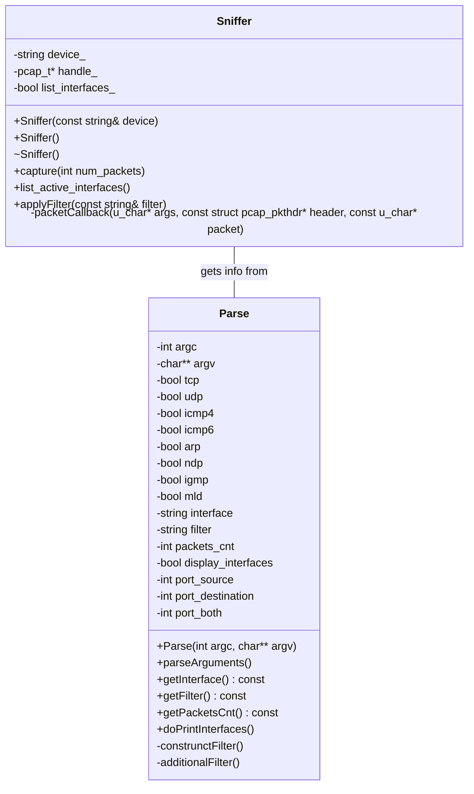

# IPK-SNIFFER (ZETA)
by **xkhoda01** - **VUT FIT** student - **Dmytro Khodarevskyi**
## Table of Contents

- [IPK-SNIFFER (ZETA)](#ipk-sniffer-zeta)
  - [Table of Contents](#table-of-contents)
  - [Introduction](#introduction)
  - [Getting Started](#getting-started)
    - [Prerequisites](#prerequisites)
    - [Installation](#installation)
  - [Testing](#testing)
      - [Process](#process)
      - [I/O example](#io-example)
  - [License](#license)
  - [Acknowledgements](#acknowledgements)

## Introduction

This is a simple sniffer for traffic capturing. It can capture and display the traffic on the network interface. The sniffer is written in C++ and uses the `pcap` library to capture the traffic.

## Getting Started

These instructions will get you a copy of the project up and running on your local machine for development and testing purposes.


### Prerequisites

C++ compiler and `make` utility are required to build the project. The project is tested on `g++` compiler.

The client itself desired to run on **Linux OS**. The project was tested on **Ubuntu**.

### Installation

1. Clone the repo
   ```sh
   git clone https://git.fit.vutbr.cz/xkhoda01/IPK_2nd_project.git
    ```
2. Build the project
    ```sh
    make
    ```
3. Run the client
    ```sh
    ./ipk-sniffer <args>
    ```

## Usage

The sniffer can display different interfaces and capture the traffic on the selected interface, including filtering. The sniffer supports the following arguments:


- **-i interface**, **--interface interface**
  - Specifies the network interface to sniff (e.g., `eth0`). If no interface or other parameters are specified, the program will display a list of all active network interfaces.

- **-t**, **--tcp**
  - Displays TCP segments. This option can be combined with `-p` or `--port-*` to apply a filter based on TCP port numbers.

- **-u**, **--udp**
  - Displays UDP datagrams. Like the TCP option, this can be used with `-p` or `--port-*` to filter traffic based on UDP port numbers.

- **-p**, **--port-source port**, **--port-destination port**
  - Filters TCP/UDP packets based on the specified port number. The port can appear either in the source or destination part of the packet headers. If no port is specified, port-based filtering is not applied.
    - **--port-destination port**: Filters packets where the specified port is in the destination field.
    - **--port-source port**: Filters packets where the specified port is in the source field.

- **--icmp4**
  - Captures only ICMPv4 packets.

- **--icmp6**
  - Captures only ICMPv6 echo request and response packets.

- **--arp**
  - Captures only ARP frames.

- **--ndp**
  - Captures only NDP packets, which are a subset of ICMPv6.

- **--igmp**
  - Captures only IGMP packets.

- **--mld**
  - Captures only MLD packets, which are a subset of ICMPv6.

- **-n num**
  - Specifies the number of packets to capture. If not set, the default behavior is to capture just one packet.

**Note:** If no specific protocols are defined, the sniffer will consider all traffic for capture and display.


## Architecture

The client is written in C++ and uses the `libpcap` library to capture the traffic. The client is designed to be simple and easy to use. The project is OOP based and uses classes to encapsulate the functionality of the client.

Below you can see the class diagram of the client:


## Testing

The project was tested by hand using `tcpdump`. Also it was tested using python script.

*Some additional testing scripts were used provided by colleges to test the project and its edge cases.*

#### Process

```
Ran 8 tests in 26.291s

OK
```
All tests passed successfully.

There are such tests as:
- Ndp packets testing (2 tests)
- TCP packets testing
- UDP packets testing
- Arp packets testing
- test for ICMPv4 packets
- test for ICMPv6 packets (2 tests)
  
Tests checks the IP, ports, and other fields of the packets.

Also `eth0` interface was tested by hand with comparing on `tcpdump`.

The script itself runs on python3 and 
sends different types of packets to the loopback interface. For example:
```
Sent 1 packets.
..
Sent 1 packets.
..
```

In some cases `gdb` debugging was used to find the problem in the code or the *print debugging*.

#### I/O example

> Input from test
```
./ipk-sniffer -i lo -icmp6

./ipk-sniffer -i lo --udp -p 12345
```
> Sniffer output
```
Timestamp: 2024-04-20T15:31:21.109+02:00
src MAC: 00:00:00:00:00:00
dst MAC: 00:00:00:00:00:00
frame length: 73 bytes
src IP: ::1
dst IP: ::1
byte_offset: 62

0x0000:  ff ff ff ff ff ff 00 00 00 00 00 00 86 dd 60 00 ........ ......`.
0x0010:  00 00 00 13 3a 40 00 00 00 00 00 00 00 00 00 00 ....:@.. ........
0x0020:  00 00 00 00 00 01 00 00 00 00 00 00 00 00 00 00 ........ ........
0x0030:  00 00 00 00 00 01 80 00 7b 37 00 00 00 00 48 65 ........ {7....He
0x0040:  6c 6c 6f 20 49 50 76 36 21                      llo IPv6 !

Timestamp: 2024-04-20T17:17:15.489+02:00
src MAC: 00:00:00:00:00:00
dst MAC: 00:00:00:00:00:00
frame length: 50 bytes
src IP: 127.0.0.1
dst IP: 127.0.0.1
src port: 53
dst port: 12345
byte_offset: 42

0x0000:  ff ff ff ff ff ff 00 00 00 00 00 00 08 00 45 00 ........ ......E.
0x0010:  00 24 00 01 00 00 40 11 7c c6 7f 00 00 01 7f 00 .$....@. |.......
0x0020:  00 01 00 35 30 39 00 10 a4 de 54 65 73 74 20 55 ...509.. ..Test U
0x0030:  44 50                                           DP
```
> Test output
```
Sent 1 packets.
..
Sent 1 packets.
..
```

## License

This project is licensed under the **GNU General Public License v3.0**. This license allows you to freely share and modify the software, ensuring that all versions remain free and open.

For more details, see the [GNU General Public License v3.0](https://www.gnu.org/licenses/gpl-3.0.en.html).

## Acknowledgements

- **xjerab28** - Unit tests for the project. (repository: [IPK-Sniffer-Tester](https://git.fit.vutbr.cz/xjerab28/IPK-Sniffer-Tests/src/branch/main/ipkSnifferTests.py)) 
- **TCPDump libpcap documentation** - for helping with the project problem studying and debugging help. ([LibPcap](https://www.tcpdump.org/pcap.html))


